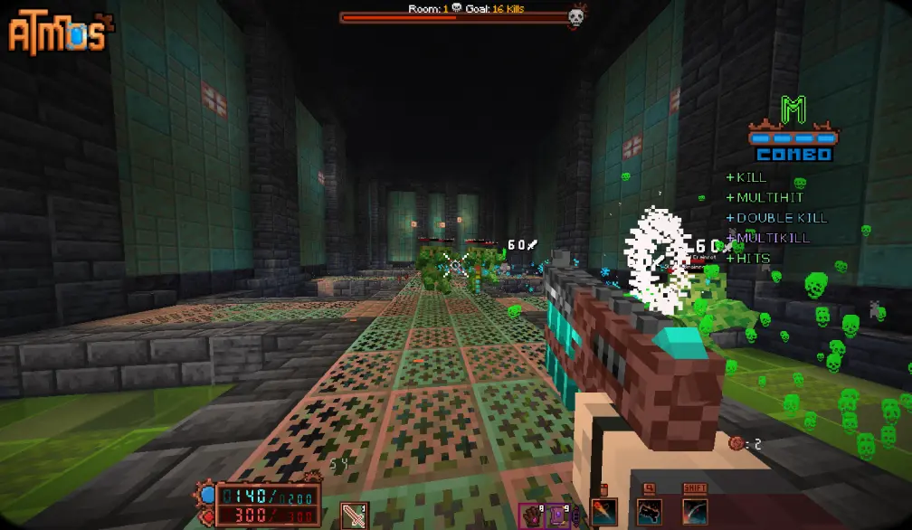
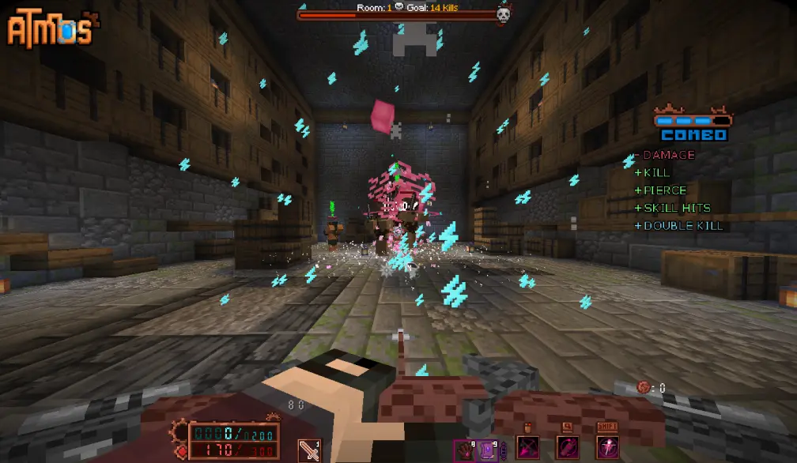
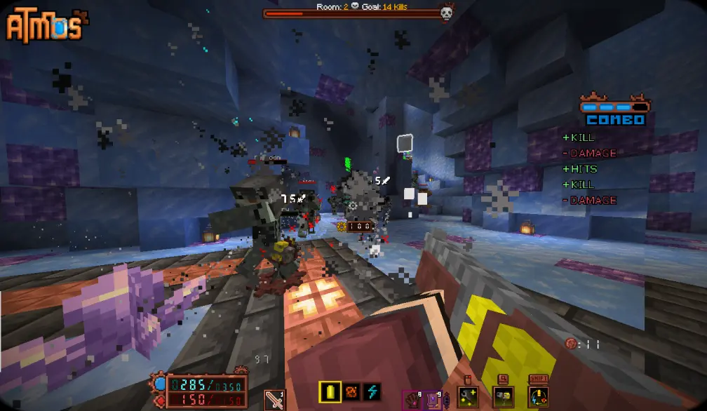
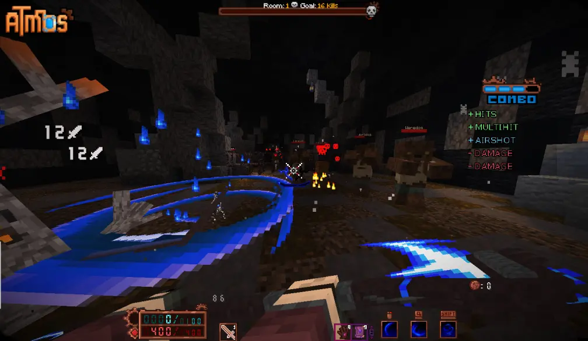

# Atmos

**Type:** Map  
**Core Gameplay:** Roguelike Action Adventure  
**Minecraft Version:** 1.21.4  
**Multiplayer Support:** No  
**Language Support:** English / Chinese  
**Played:** No  
**Rating:** ⭐⭐⭐⭐

---

## 📌 Overview

**Atmos** is a Minecraft map designed around **roguelike-style action and progression**, drawing inspiration from fast-paced titles like _Hades_ and _Ultrakill_. Built entirely using vanilla Minecraft mechanics and resource packs, this map transforms the game into a dynamic adventure with intense combat, character progression, and randomized elements.

Players explore unique regions, battle diverse enemies, discover relics and upgrades, and face increasingly difficult challenges as they progress. Atmos also provides an internal save system, allowing players to preserve progress between sessions and build toward long-term mastery.

---

## Screenshots

---

## 🎯 Key Features

- **Roguelike Combat Loop** – Fast-paced fights with scaling difficulty
- **Relics & Upgrades** – Collect powerful items that change gameplay
- **Boss Encounters** – Challenging boss battles with unique mechanics
- **Progress Persistence** – Built-in save functionality for long-term runs
- **Vanilla-driven Logic** – Designed using standard Minecraft systems

---

## Versions

| Version                                                                                   | Notes |
| ----------------------------------------------------------------------------------------- | ----- |
| [v1.1.1](https://github.com/yixuanhuang04/minecraft-collection/releases/tag/atmos-v1.1.1) |       |

---

## Installation

### Singleplayer

1. Extract the downloaded archive.
2. Move the map folder into your `.minecraft/saves` directory.
3. Launch Minecraft and load the world in Singleplayer mode.

### Language Support

To use Chinese translations, make sure the Chinese language resource pack is also enabled.

---

## 🧠 Tips & Notes

- This map is **not designed for multiplayer**; best experienced solo.
- Atmos uses custom loot and upgrade systems — take time to experiment with relic combinations.
- If you encounter issues, check for required datapacks or resource packs included with the map.
