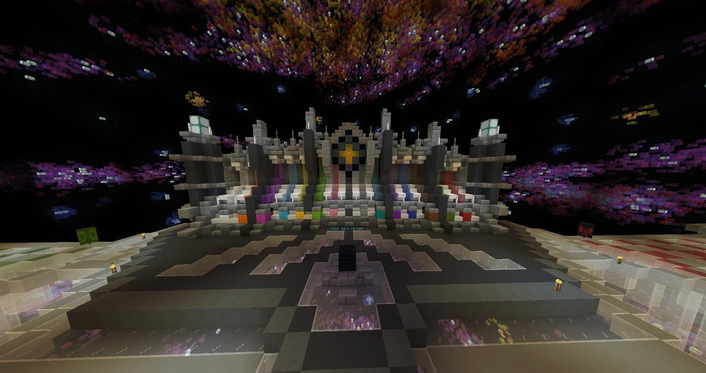
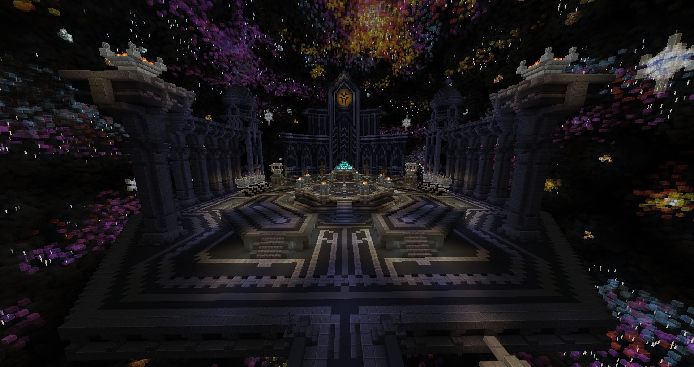
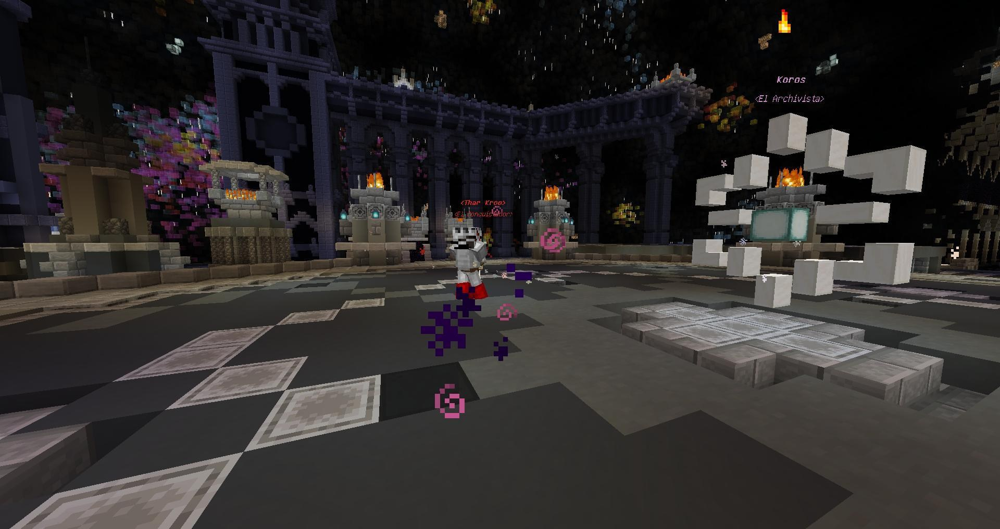

# Final Paradox

**Type:** Map  
**Core Gameplay:** Large-scale CTM Challenge  
**Minecraft Version:** 1.16.5  
**Multiplayer Support:** Yes  
**Language Support:** English / Chinese  
**Played:** Yes  
**Rating:** ⭐⭐⭐⭐

---

## Overview

**Final Paradox** is a large-scale CTM (Complete the Monument) map built around long-form progression and high-difficulty challenges. Players advance by conquering structured regions, overcoming combat-heavy encounters, and collecting objective items required to complete the monument.

The map focuses on endurance, strategic preparation, and consistent skill improvement. As players move forward, areas become more complex, enemies grow stronger, and environmental hazards demand careful planning.

---

## Screenshots

---

## Key Features

- **Structured CTM Progression** — Clear objective-based advancement through multiple regions
- **High Difficulty Curve** — Increasingly demanding combat and survival scenarios
- **Large Map Scale** — Expansive areas designed for long-term play
- **Preparation-Oriented Gameplay** — Resource management and gear planning are essential

---

## Versions

| Version                                                                                             | Notes |
| --------------------------------------------------------------------------------------------------- | ----- |
| [v1.1.15](https://github.com/yixuanhuang04/minecraft-collection/releases/tag/final-paradox-v1.1.15) |       |

---

## Installation

### Singleplayer

1. Extract the downloaded archive.
2. Move the map folder into your `.minecraft/saves` directory.
3. Launch Minecraft and load the world in Singleplayer mode.

### Multiplayer

1. Copy `resources.zip` from the map folder.
2. Distribute it to all players.
3. Place it into `.minecraft/resourcepacks` (for the correct game version).
4. Enable the resource pack in-game before joining.

> ⚠️ Do **not** rely on server-side automatic resource pack download.  
> This may cause some translations or assets to fail loading.

### Language Support

To use Chinese translations, make sure the Chinese language resource pack is also enabled.

---

## Tips & Notes

- Recommended for players familiar with CTM-style maps and extended challenge runs.
- Multiplayer cooperation can significantly improve survivability.
- Expect a long completion time due to map scale and difficulty.
