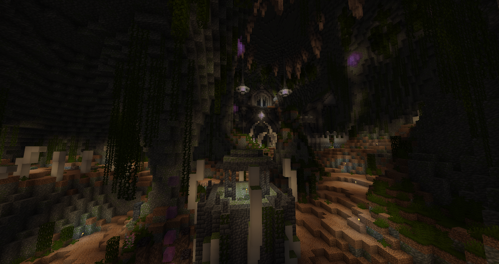
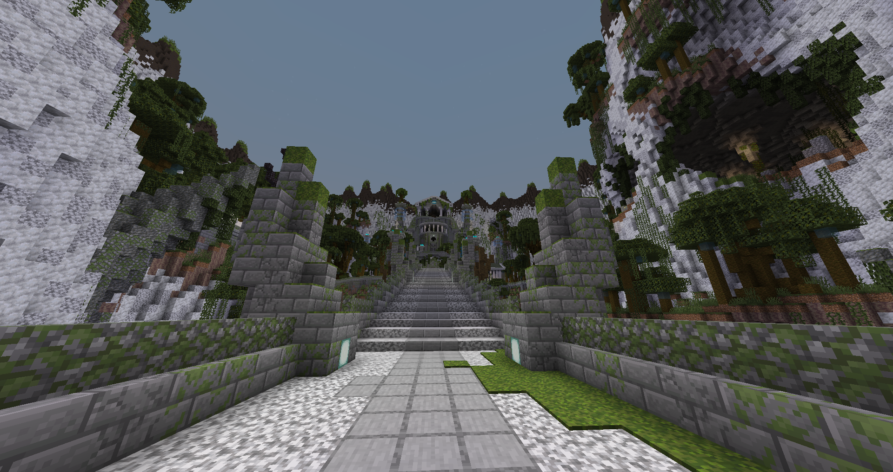
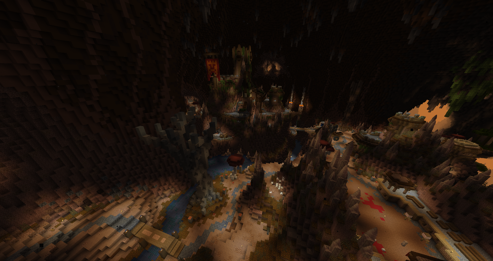
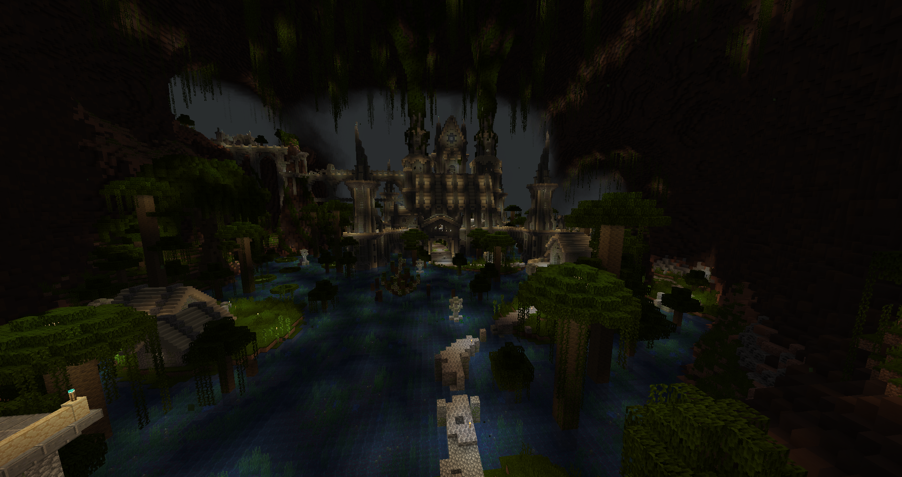

# Ragecraft IV: Underworld

**Type:** Map  
**Core Gameplay:** CTM Combat Adventure  
**Minecraft Version:** 1.20.1  
**Multiplayer Support:** Yes  
**Language Support:** English / Chinese  
**Played:** No  
**Rating:** ⭐⭐⭐⭐

---

## Overview

**Ragecraft IV: Underworld** is a CTM (Complete the Monument) adventure map focused on high-intensity combat and intricate dungeon design. Players progress by conquering hostile regions, overcoming dense enemy encounters, and collecting monument objectives required to complete the map.

The experience emphasizes combat skill, positioning, and preparation. Dungeons are designed with layered encounters, environmental hazards, and escalating difficulty, making the map particularly appealing to players who enjoy tactical fights and structured challenge progression.

---

## Screenshots

---

## Key Features

- **Combat-Focused CTM Design** — Frequent and challenging enemy encounters
- **Complex Dungeon Layouts** — Multi-layered areas with traps and hazards
- **Progressive Difficulty** — Regions become increasingly dangerous over time
- **Objective-Based Advancement** — Monument collection drives progression

---

## Versions

| Version                                                                                        | Notes |
| ---------------------------------------------------------------------------------------------- | ----- |
| [v1.2.0](https://github.com/yixnhuang/minecraft-collection/releases/tag/ragecraft4-v1.2.0) |       |

---

## Installation

### Singleplayer

1. Extract the downloaded archive.
2. Move the map folder into your `.minecraft/saves` directory.
3. Launch Minecraft and load the world in Singleplayer mode.

### Multiplayer

1. Copy `resources.zip` from the map folder.
2. Distribute it to all players.
3. Place it into `.minecraft/resourcepacks` (for the correct game version).
4. Enable the resource pack in-game before joining.

> ⚠️ Do **not** rely on server-side automatic resource pack download.  
> This may cause some translations or assets to fail loading.

### Language Support

To use Chinese translations, make sure the Chinese language resource pack is also enabled.

---

## Tips & Notes

- Multiplayer cooperation is recommended due to combat intensity.
- Carry sufficient supplies before entering deeper dungeon sections.
- Expect frequent high-risk encounters requiring careful positioning.
