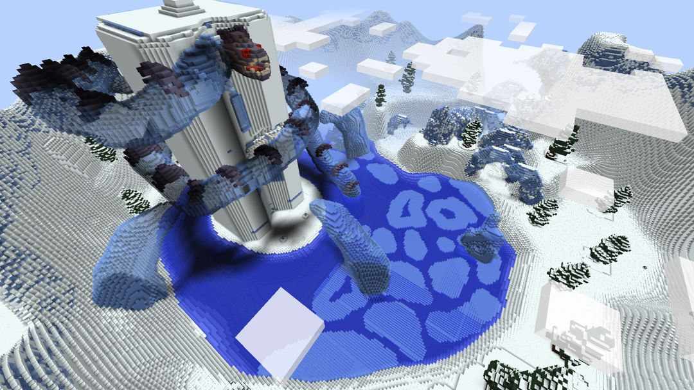

# Terra Restore

**Type:** Map  
**Core Gameplay:** CTM + RPG Adventure  
**Minecraft Version:** 1.8.1  
**Multiplayer Support:** Yes  
**Language Support:** English / Chinese  
**Played:** No  
**Rating:** ⭐⭐⭐⭐⭐

---

## Overview

**Terra Restore** is a large-scale CTM (Complete the Monument) adventure map that blends structured objective-based progression with RPG-style exploration and combat. Players journey through diverse environments, complete dungeon challenges, and gather monument items while uncovering story-driven elements along the way.

The map emphasizes gradual progression, environmental storytelling, and increasingly complex encounters, making it suitable for players who enjoy long-form adventure experiences with both combat and exploration components.

---

## Screenshots

---

## Key Features

- **CTM Progression System** — Collect monument objectives to advance through the map
- **Dungeon Exploration** — Structured areas with enemy encounters and loot rewards
- **RPG Elements** — Equipment progression and character growth over time
- **Boss Encounters** — Major fights that gate progression and test preparation

---

## Versions

| Version                                                                                           | Notes |
| ------------------------------------------------------------------------------------------------- | ----- |
| [v1.4.3](https://github.com/yixuanhuang04/minecraft-collection/releases/tag/terra-restore-v1.4.3) |       |

---

## Installation

### Singleplayer

1. Extract the downloaded archive.
2. Move the map folder into your `.minecraft/saves` directory.
3. Launch Minecraft and load the world in Singleplayer mode.

### Multiplayer

1. Copy `resources.zip` from the map folder.
2. Distribute it to all players.
3. Place it into `.minecraft/resourcepacks` (for the correct game version).
4. Enable the resource pack in-game before joining.

> ⚠️ Do **not** rely on server-side automatic resource pack download.  
> This may cause some translations or assets to fail loading.

### Language Support

To use Chinese translations, make sure the Chinese language resource pack is also enabled.

---

## Tips & Notes

- Designed for multiplayer cooperation, but can be played solo with higher difficulty.
- Exploration and preparation are key before entering major dungeon areas.
- Expect extended playtime; this is a long-form adventure map.
