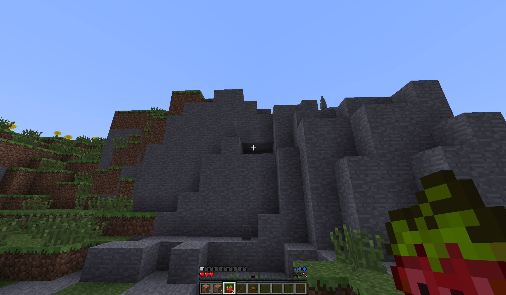

# MITE-breaking everything

**Type:** Modpack  
**Core Gameplay:** Hardcore Survival / Survival Overhaul  
**Minecraft Version:** 1.6.4  
**Multiplayer Support:** Yes  
**Language Support:** English / Chinese  
**Played:** No  
**Rating:** ⭐⭐⭐⭐

---

## Overview

**MITE-breaking everything** is a high-difficulty Minecraft survival modpack built upon the philosophy of _Minecraft Is Too Easy (MITE)_. It significantly increases realism, survival pressure, and gameplay complexity, turning standard Minecraft progression into a long-term, strategic challenge.

The modpack emphasizes careful resource management, environmental awareness, and combat preparation. Players must adapt to a world where gathering materials requires planning, threats are more lethal, and mistakes carry heavier consequences than in vanilla gameplay.

---

## Screenshots

---

## Key Features

- **Survival Overhaul** — Core systems such as health, hunger, and combat are rebalanced for realism and difficulty
- **Resource Economy** — Scarcity and progression pacing force strategic planning
- **World Danger Scaling** — Mobs and environments present persistent threats
- **Long-term Progression** — Emphasis on preparation and sustainable survival

---

## Versions

| Version                                                                                                  | Notes                                           |
| -------------------------------------------------------------------------------------------------------- | ----------------------------------------------- |
| [v0.9](https://github.com/yixnhuang/minecraft-collection/releases/tag/mite-breaking-everything-v0.9) | Early build with core survival overhaul systems |

---

## Tips & Notes

- This modpack is designed for experienced players who enjoy high difficulty and slow progression.
- Multiplayer is supported and can enhance the survival experience through cooperation.
- Refer to version folders for mod lists and configuration details.
